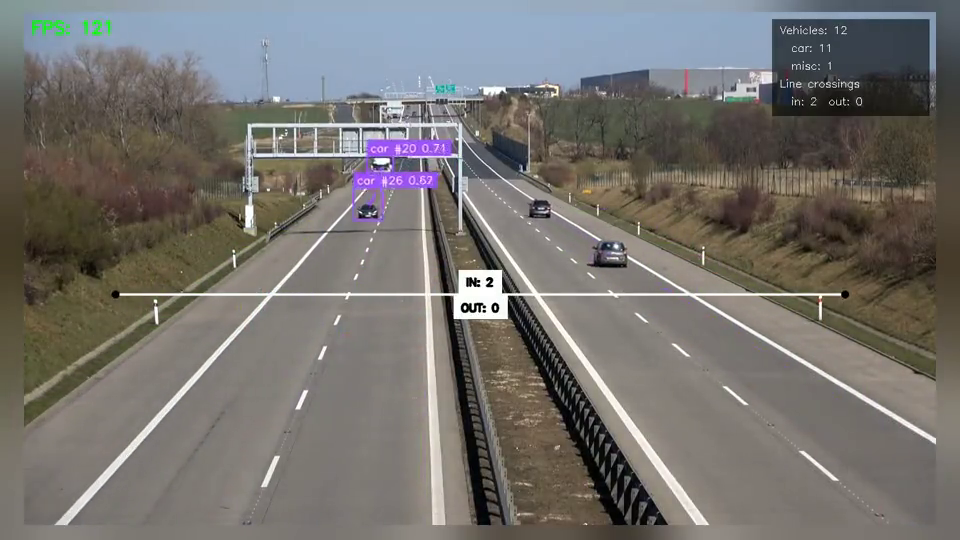
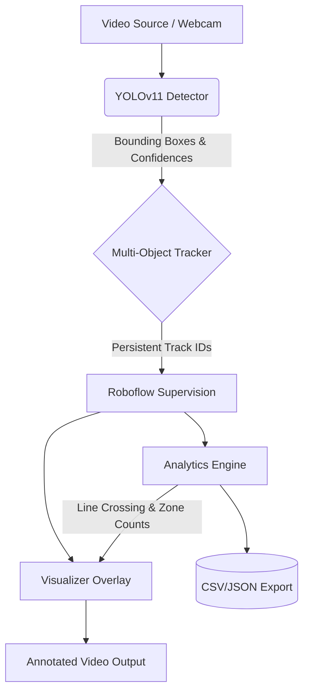
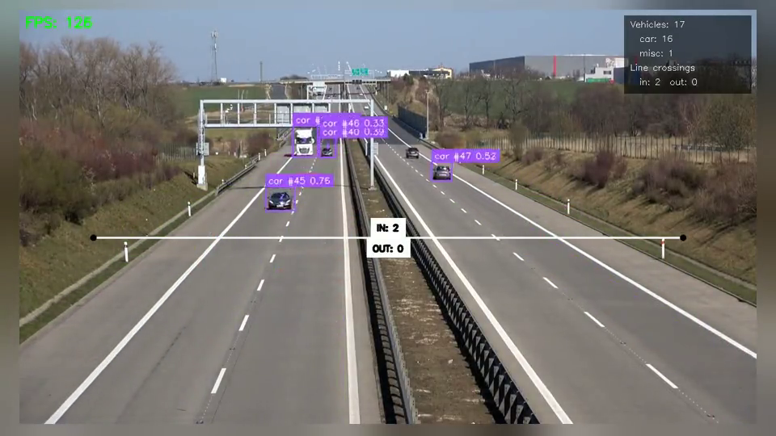
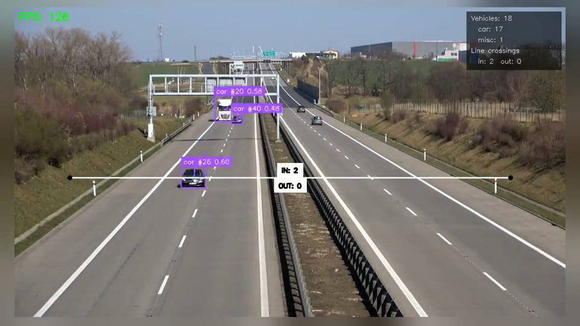
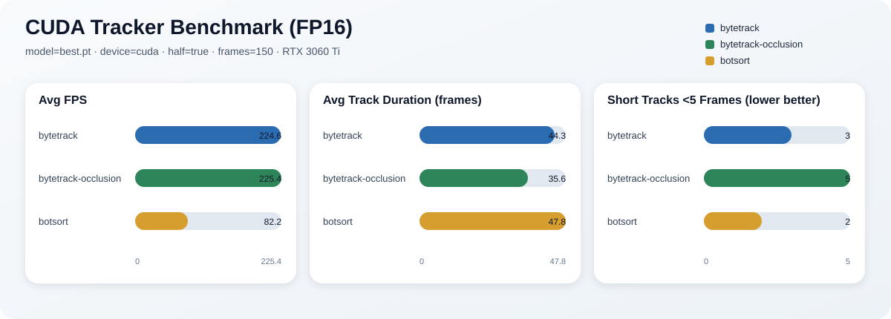

# vtrack — Vehicle Detection & Tracking Pipeline

End-to-end vehicle detection, multi-object tracking, and analytics pipeline built on YOLOv11 and fine-tuned on the KITTI dataset.

> **Portfolio / PoC note:** This repository is an end-to-end ML demonstration — dataset → fine-tune → eval → tracking → analytics → artifact publishing on a consumer GPU. It is not a production traffic analytics product.
<p align="center">
  <a href="https://github.com/h01t/vtrack/releases/download/media/demo-short.mp4">
    
  </a>
</p>

<p align="center"><sub>Open the short demo video</sub></p>

## What This Project Does

vtrack takes video input (file, webcam, RTSP stream, or YouTube URL) and:

1. **Detects** vehicles frame-by-frame using YOLOv11
2. **Tracks** them across frames with persistent IDs via ByteTrack
3. **Visualizes** bounding boxes, track trails, and an FPS counter in real-time
4. **Analyzes** traffic patterns — line-crossing counts, zone occupancy, per-class breakdowns, and track duration statistics
5. **Exports** analytics to CSV (per-frame) and JSON (summary)

## High-Level Architecture



## Visual Tour

| Tracking + Trails | Analytics Overlay |
|-------------------|-------------------|
|  |  |
| Persistent IDs and motion trails follow each vehicle through the scene. | A tripwire counting line increments **in/out** when a track centroid crosses; the panel shows unique IDs and crossings. |

## Why This Stack

| Component | Choice | Reasoning |
|-----------|--------|-----------|
| **Detection** | YOLOv11 (Ultralytics) | State-of-the-art single-stage detector. Ultralytics provides a clean Python API with built-in training, validation, export, and tracker integration — no glue code needed. |
| **Tracking** | ByteTrack (via Ultralytics) | Lightweight, high-performance multi-object tracker that handles occlusion well. Ships with Ultralytics, so `model.track()` is a one-liner with `persist=True` for frame-to-frame ID persistence. |
| **Visualization** | supervision (Roboflow) | Purpose-built for CV annotation overlays. Provides `BoxAnnotator`, `TraceAnnotator`, `LineZone`, `PolygonZone` out of the box — significantly less boilerplate than raw OpenCV drawing. |
| **Dataset** | KITTI | Well-established autonomous driving benchmark with 7,481 annotated images and 8 vehicle-relevant classes. Hosted under `/srv/ai/datasets/kitti` on blackbox. |
| **Training hardware** | NVIDIA GeForce RTX 3060 Ti (8 GiB) | Local CUDA on **blackbox**. 50 epochs completed in ~28 minutes. MPS training is unsupported (PyTorch YOLO task-assigner bug). |
| **Environment** | uv + Python 3.12 | Fast dependency resolution, lockfile support, and no need for conda. |

## Model Results

**Fine-tuned YOLOv11n on KITTI (50 epochs, blackbox 3060 Ti CUDA)** — from `artifacts/train/vehicle_v1/summary.json`

| Metric | Value |
|--------|-------|
| mAP@0.5 | **0.850** |
| mAP@0.5:0.95 | 0.608 |
| Precision | 0.865 |
| Recall | 0.761 |
| Training time | ~28 minutes |
| Model size | 5.4 MB |

**Per-class performance (mAP@0.5):**

| Class | mAP@0.5 |
|-------|---------|
| Car | 0.958 |
| Van | 0.929 |
| Truck | 0.953 |
| Pedestrian | 0.772 |
| Person sitting | 0.575 |
| Cyclist | 0.815 |
| Tram | 0.945 |
| Misc | 0.854 |

The pretrained COCO model scored mAP@0.5 of 0.022 on KITTI due to class ID mismatch — fine-tuning gave a **~39x improvement**.

## Formal MOT metrics (MOT17)

Methodology proof on **MOTChallenge MOT17** pedestrian tracks (not vehicle/KITTI). Detector: COCO-pretrained `yolo11n.pt` + ByteTrack. Sequence: `MOT17-02-FRCNN` (600 frames, train split). Not a hidden-test leaderboard submission.

| Metric | Value |
|--------|-------|
| HOTA | 0.262 |
| MOTA | 0.199 |
| IDF1 | 0.274 |

```bash
uv sync --extra mot
uv run python tasks/download_mot17.py --keep-only-poc
uv run vtrack evaluate-mot --sequences MOT17-02 --model yolo11n.pt --device cuda --name mot17_poc
```

Artifact summary: `artifacts/eval/mot17_mot17_poc/summary.json`.

## CUDA Performance

Latency on blackbox **RTX 3060 Ti** using a 150-frame continuous traffic clip (`data/test-video.mp4`). Full rows: [`docs/media/benchmark-cuda.csv`](docs/media/benchmark-cuda.csv). Chart below uses fine-tuned `best.pt` with `--half`.

| Model | Tracker | half | Avg FPS | p95 ms | Peak VRAM |
|-------|---------|------|---------|--------|-----------|
| best.pt (YOLOv11n KITTI) | bytetrack | false | 240.1 | 4.3 | 469 MiB |
| best.pt | bytetrack-occlusion | false | 237.2 | 4.4 | 469 MiB |
| best.pt | botsort | false | 83.9 | 12.7 | 469 MiB |
| best.pt | bytetrack | true | 224.6 | 4.9 | 447 MiB |
| best.pt | bytetrack-occlusion | true | 225.5 | 4.7 | 447 MiB |
| best.pt | botsort | true | 82.2 | 12.9 | 447 MiB |
| yolo11s.pt (COCO pretrained) | bytetrack | true | 217.9 | 5.0 | 477 MiB |

BoT-SORT is slower than ByteTrack because of CPU-side GMC (`sparseOptFlow`). Half precision mainly reduces VRAM on this short clip; ByteTrack FPS stays in the same band.



Reproduce: `uv run python tasks/cuda_perf_card.py`. Clip provenance: [docs/media/README.md](docs/media/README.md).

## Project Structure

```
vtrack/
├── src/vtrack/              # Installable package
│   ├── cli.py               # Unified `vtrack` CLI
│   ├── settings.py          # Typed settings + canonical path layout
│   ├── model_profiles.py    # Checkpoint metadata / class profile resolution
│   ├── artifacts.py         # Normalized artifact bundle publishing
│   ├── workflows.py         # Shared runtime / train / eval workflows
│   ├── benchmarking.py      # Tracking benchmark report generation
│   ├── tracker_presets.py   # Built-in tracker preset resolution
│   ├── detect.py            # VehicleDetector — image/video detection
│   ├── track.py             # VehicleTracker — ByteTrack / BoT-SORT integration
│   ├── trackers/            # Repo-owned tracker YAML presets
│   ├── visualize.py         # Visualizer — boxes, trails, FPS overlay
│   ├── analytics.py         # VehicleAnalytics — counting, zones, export
│   └── pipeline.py          # VehiclePipeline — end-to-end orchestrator
├── configs/                 # Host dataset configs (e.g. kitti.yaml → /srv/ai)
├── scripts/                 # Backward-compatible wrappers around `vtrack`
├── models/                  # Local published checkpoints (gitignored)
├── artifacts/               # Normalized train/eval bundles (gitignored)
├── runs/                    # Raw Ultralytics outputs (gitignored)
├── data/                    # Local sample media (gitignored)
├── tests/                   # Fast unit/CLI tests + opt-in smoke test
└── pyproject.toml
```

## Quick Start

Canonical compute host is **blackbox** (Linux + RTX 3060 Ti). Use the Mac only as a Remote SSH / viewing client.

```bash
# On blackbox
git clone <repo-url> && cd vtrack
cp .env.example .env   # optional; defaults already point at /srv/ai
uv sync
uv sync --extra dev   # recommended for pytest + ruff

# Run with fine-tuned KITTI model (CUDA)
uv run vtrack demo data/test-video.mp4 --model models/best.pt --device cuda

# Enable analytics with a counting line (tripwire: in/out crossings)
uv run vtrack demo data/test-video.mp4 \
    --model models/best.pt \
    --device cuda \
    --no-display \
    --analytics \
    --line 0,400,1280,400 \
    --export-json /srv/ai/outputs/vtrack/summary.json \
    --export-csv /srv/ai/outputs/vtrack/frames.csv \
    --save /srv/ai/outputs/vtrack/annotated.mp4

# Webcam (live, display on the machine with a monitor/X)
uv run vtrack demo 0 --model models/best.pt --device cuda --analytics

# Single image detection
uv run vtrack detect-image data/test-image.jpg --device cuda

# Compare built-in tracker presets on the same clip
uv run vtrack benchmark-track data/test-video.mp4 \
    --model models/best.pt \
    --device cuda \
    --tracker bytetrack \
    --tracker bytetrack-occlusion \
    --tracker botsort \
    --max-frames 150 \
    --export-csv /srv/ai/outputs/vtrack/benchmark.csv
```

The legacy `scripts/*.py` entrypoints still work, but they now delegate to the same installable CLI.

### Mac access pattern

- Open `/home/tron/projects/vtrack` via Cursor / VS Code **Remote SSH** (`tron@blackbox`).
- Long jobs belong in `tmux` (e.g. `tmux new -A -s vtrack`) so Mac sleep/disconnect does not kill training.
- View outputs with `scp`/`rsync` from `/srv/ai/outputs/vtrack` or browse them in the Remote SSH workspace.

## Runtime Inference and Tracking

### Core Commands

```
usage: vtrack <command> [options]

commands:
  demo                  Tracking + analytics on a video source
  benchmark-track       Compare tracking presets on a shared source
  detect-image          Single-image detection
  detect-video          Detection-only video pass
  train                 Local CUDA training (primary on blackbox)
  evaluate              Local evaluation and optional baseline comparison
  evaluate-mot          MOT17 HOTA/MOTA/IDF1 (TrackEval; person tracks)
  serve                 Localhost FastAPI detect/track API
  export-onnx           Export checkpoint to ONNX
  benchmark-export      Compare .pt vs ONNX Runtime latency
  train-remote          Legacy remote push/train/pull helper

See `uv run vtrack <command> --help` for subcommand-specific options.
```

### Tracking Presets

- `bytetrack` — repo-owned baseline matching Ultralytics ByteTrack defaults
- `bytetrack-occlusion` — longer lost-track buffer (`track_buffer=60`) for heavier occlusion
- `botsort` — repo-owned BoT-SORT baseline with `gmc_method=sparseOptFlow` and `with_reid=False`
- `--tracker` accepts any preset alias above or an explicit YAML path

### Runtime Notes

- For tracking commands, `--track-conf` controls the detector threshold fed into the tracker, while `--confidence` controls the minimum confidence kept for overlays, analytics, and exported summaries.
- `vtrack benchmark-track` runs one or more tracker presets sequentially on the same source and prints a JSON report to stdout. If `--export-csv` is provided, it also writes one summary row per run.
- Prefer `--device cuda` on blackbox. Check `nvidia-smi` first — the 8 GiB 3060 Ti should not share heavy jobs (translation services, large ComfyUI graphs) with training.
- MPS remains available for Apple Silicon *inference* only; do not use MPS for training (PyTorch YOLO task-assigner bug).

### More Examples

```bash
# Run with pretrained model (auto-downloads yolo11n.pt)
uv run vtrack demo data/test-video.mp4 --device cuda --no-display

# Use a repo-owned tracker preset tuned for longer occlusions
uv run vtrack demo data/test-video.mp4 \
    --model models/best.pt \
    --device cuda \
    --tracker bytetrack-occlusion \
    --track-conf 0.10

# Detection-only video pass
uv run vtrack detect-video data/test-video.mp4 --model models/best.pt --device cuda --save
```

## Training

### Local CUDA training (recommended on blackbox)

KITTI lives under `/srv/ai/datasets/kitti`. The repo ships [`configs/kitti.yaml`](configs/kitti.yaml) with an absolute `path` so Ultralytics does not re-download the dataset.

```bash
# Free the GPU first: nvidia-smi
tmux new -A -s vtrack

uv run vtrack train \
  --model yolo11n.pt \
  --data configs/kitti.yaml \
  --epochs 50 \
  --imgsz 640 \
  --batch 16 \
  --device cuda \
  --name vehicle_v1
```

Defaults: `--device cuda`, dataset alias `kitti.yaml` resolves via `VTRACK_KITTI_YAML` / `configs/kitti.yaml` / `/srv/ai/datasets/kitti/kitti.yaml`.

On OOM with 8 GiB VRAM, drop `--batch` to `8` or `4` before changing `imgsz`. Keep AMP enabled (default).

### Evaluation

```bash
uv run vtrack evaluate --model models/best.pt --data configs/kitti.yaml

uv run vtrack evaluate \
    --model models/best.pt \
    --data configs/kitti.yaml \
    --compare
```

### Legacy remote training

`train-remote` remains for Mac→SSH push workflows but is no longer the happy path. Prefer local `vtrack train` on blackbox.

## Localhost inference API

Thin FastAPI service bound to **127.0.0.1** only (OpenAPI at `/docs`):

```bash
uv sync --extra api
uv run vtrack serve --model models/best.pt --device cuda --host 127.0.0.1 --port 8000

curl -s http://127.0.0.1:8000/health
curl -s -F "file=@path/to/frame.jpg" http://127.0.0.1:8000/v1/detect
curl -s -F "file=@path/to/frame.jpg" -F "session_id=demo" http://127.0.0.1:8000/v1/track
```

## Deploy (ONNX)

Thin export + latency compare on blackbox (no public bind; run locally or via Remote SSH):

```bash
uv sync --extra export

uv run vtrack export-onnx --model models/best.pt --imgsz 640
# → models/best.onnx (+ mirror under /srv/ai/checkpoints/vtrack/)

uv run vtrack benchmark-export data/test-video.mp4 \
  --pt-model models/best.pt \
  --onnx-model models/best.onnx \
  --device cuda \
  --max-frames 150
```

| Runtime | Model | Avg FPS | p95 ms | Notes |
|---------|-------|---------|--------|-------|
| PyTorch CUDA | `models/best.pt` | 326.2 | 3.3 | Ultralytics predict stream |
| ONNX Runtime CUDA EP | `models/best.onnx` | 247.0 | 4.3 | `onnxruntime-gpu==1.27.0` |

ONNX is the portable deploy artifact for this PoC. TensorRT / CoreML / edge boards are deferred.

## Artifacts

- Normalized bundles are written to `artifacts/train/<run-name>/` and `artifacts/eval/<run-name>/`.
- Each bundle includes `manifest.json`, `summary.json`, copied plots, and copied weights when relevant.
- Raw Ultralytics outputs live under `runs/` and are treated as implementation detail.
- Training copies canonical checkpoints into `models/best.pt` / `models/last.pt` (plus named copies) and mirrors them to `/srv/ai/checkpoints/vtrack` (`VTRACK_CHECKPOINT_DIR`).
- Demo / export outputs should prefer `/srv/ai/outputs/vtrack` (`VTRACK_OUTPUT_DIR`).

## Development

```bash
# Install project + dev tools
uv sync --extra dev
uv sync --extra export   # ONNX export / ORT compare
uv sync --extra api      # localhost FastAPI serve
uv sync --extra mot      # TrackEval MOT17 metrics

# Lint and tests (matches CI; smoke excluded)
uv run ruff check src scripts tests
uv run pytest -m "not smoke"

# Opt-in smoke evaluation against local assets (GPU/weights/dataset)
VTRACK_RUN_SMOKE=1 uv run pytest -m smoke
```

GitHub Actions runs the same non-smoke lint/test gate on PRs and `main`.

## PoC status

- [x] KITTI fine-tune on blackbox CUDA with published metrics + artifact bundles
- [x] Tracking + analytics CLI (`demo`, `benchmark-track`)
- [x] CUDA latency card + README media from continuous traffic footage
- [x] ONNX export path + `.pt` vs ONNX Runtime FPS/VRAM compare
- [x] CI: ruff + non-smoke pytest
- [x] Formal MOTA/HOTA/IDF1 on MOT17 (person tracks, TrackEval)
- [x] Localhost inference API (`vtrack serve`, 127.0.0.1)
- [x] Fixed-camera continuous video (Roboflow highway clip; not dashcam / not KITTI stills)

## Reliability & Local Quality Tooling

- Troubleshooting guide: [`docs/troubleshooting.md`](docs/troubleshooting.md)
- Local hardening architecture notes: [`docs/architecture-local-hardening.md`](docs/architecture-local-hardening.md)
- Benchmark regression checker: [`tasks/benchmark_regression.py`](tasks/benchmark_regression.py)
- CUDA perf card driver: [`tasks/cuda_perf_card.py`](tasks/cuda_perf_card.py)

### Benchmark regression check

```bash
uv run python tasks/benchmark_regression.py \
  --current docs/media/benchmark-cuda.csv \
  --baseline docs/media/benchmark-cuda.csv \
  --max-fps-regression-pct 15 \
  --max-p95-increase-pct 20 \
  --max-median-increase-pct 20
```

## Future Improvements

### Near-term
- **Longer CUDA benchmarks** — Multi-minute clips and YOLOv11s fine-tune (this PoC contrasts pretrained `yolo11s.pt` only).
- **Broader MOT17 coverage** — Add MOT17-04/09 once downloaded; keep reporting honest train-split subset metrics.

### Deploy / edge (someday)
- **TensorRT** — Optional NVIDIA-optimized path beyond ONNX Runtime.
- **Raspberry Pi** — TFLite or NCNN on constrained hardware.
- **INT8 quantization** — Further edge speedups.

### Explicitly deferred
- Multi-camera aggregation and re-identification
- Autonomous AutoTrain-style loops as a product surface
- Public internet binding for the inference API (localhost-only by design)

## Dependencies

```
ultralytics>=8.3    # YOLOv11 detection + tracking
opencv-python>=4.10 # Video I/O and display
numpy>=1.26         # Array operations
supervision>=0.25   # CV visualization and zone utilities
lapx>=0.5           # Linear assignment for tracking
```

Optional extras: `export` (ONNX), `api` (FastAPI serve), `mot` (TrackEval).

## License

MIT
