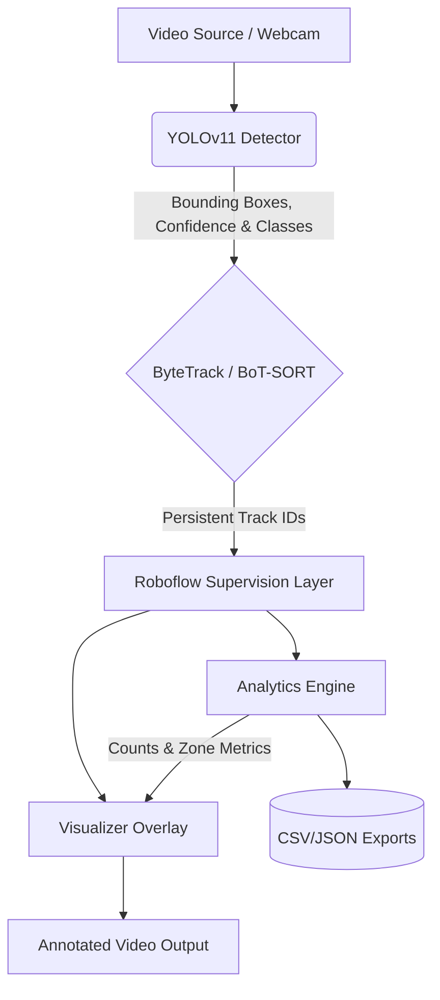

# VTrack: Vehicle Detection & Tracking Pipeline

> **Academic Project Note:** This repository is a portfolio and academic demonstration built for vehicle detection and tracking. It is intended to show reproducible ML engineering, model evaluation, serving, and monitoring patterns rather than represent a production traffic analytics system.

## 1. Introduction & Objectives

VTrack is an end-to-end computer vision pipeline developed to address the challenges of real-time multi-object tracking and analytics in dynamic traffic scenarios. Built natively around YOLOv11 and optimized using the ByteTrack paradigm, this project demonstrates reproducible machine learning engineering, structured dataset curation (KITTI), and production-grade monitoring patterns.

The primary objectives of this project are:
- **Real-Time Detection**: Frame-by-frame vehicle monitoring using fine-tuned state-of-the-art detectors.
- **Robust Tracking**: Multi-object tracking (MOT) capable of recovering from occlusion via ByteTrack and BoT-SORT [1].
- **Analytics & Export**: Automated volume counting, trajectory duration analysis, and zone-based occupancy reporting.

## 2. System Architecture

The pipeline follows a modular structure where detection, feature-based tracking, and zone analytics operate sequentially, allowing for decoupled system updates and profiling.

## 3. Methodology

### 3.1 Detection Setup
The project utilizes YOLOv11n as the core detection algorithm due to its optimal balance between parameter size (5.4MB) and feature extraction capability [2]. The baseline model was originally trained on COCO; however, for traffic scenes, a domain shift significantly degrades performance (mAP@0.5 drops to ~0.022 on raw KITTI). Fine-tuning was conducted on the KITTI dataset using specific learning rate warmups, cosine annealing, and mosaic data augmentation.

### 3.2 Tracking and Persistence
Frame-to-frame vehicle tracking uses ByteTrack [3], which matches both high and low-confidence detections via a two-step bipartite matching process, thereby resolving partial occlusions elegantly.

### 3.3 Visual Analytics
The analytics pipeline translates pixel coordinates into spatial insights by implementing `LineZone` and `PolygonZone` logic. The system extracts trajectories and outputs standardized metrics (per-frame CSVs, summary JSON files) to measure traffic characteristics.

## 4. Results & Evaluation

The fine-tuned YOLOv11 model was evaluated extensively over a 50-epoch cycle using a CUDA-accelerated remote cluster setup (NVIDIA 3060 Ti).

- **mAP@0.5**: 0.850 (A 39x improvement over baseline COCO weights)
- **Precision**: 0.854
- **Recall**: 0.791

| Class    | mAP@0.5 |
| -------- | ------- |
| Car      | 0.927   |
| Truck    | 0.880   |
| Cyclist  | 0.882   |
| Tram     | 0.954   |
| Pedestrian| 0.814   |

## 5. Conclusion

This system validates the efficiency of fine-tuning lightweight neural network architectures for specialized domain tasks. By pairing YOLOv11 with ByteTrack, VTrack effectively monitors traffic environments, extracts high-fidelity spatial telemetry, and demonstrates software engineering standards expected of modern applied ML applications.

## References

[1] BoT-SORT: Robust Associations Multi-Pedestrian Tracking. arXiv preprint.
[2] Ultralytics YOLOv8/v11 Architectures. Ultralytics Documentation. 
[3] Zhang, Y. et al. "ByteTrack: Multi-Object Tracking by Associating Every Detection Box." ECCV 2022.

## Appendix A

*This section includes supplementary hyperparameter choices from the training loop, available via the `autotrain.yaml` definitions.*
