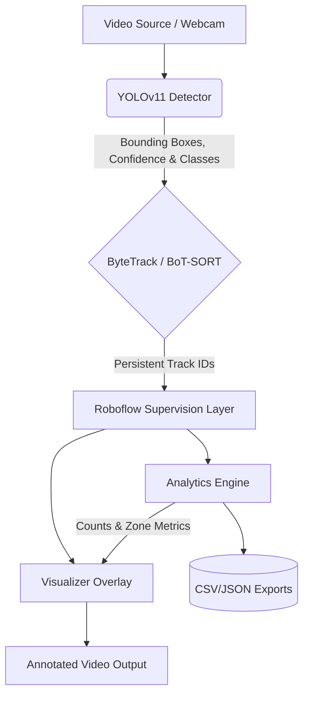

# VTrack: Vehicle Detection & Tracking Pipeline

> **Portfolio / PoC note:** End-to-end ML demonstration (dataset → fine-tune → eval → tracking → analytics → artifacts) on a consumer GPU. Not a production traffic analytics system.

## 1. Introduction & Objectives

VTrack is an end-to-end computer vision pipeline for multi-object tracking and lightweight traffic analytics. Built around YOLOv11 and ByteTrack/BoT-SORT, it emphasizes reproducible ML engineering: host-bound datasets, CUDA training on **blackbox** (RTX 3060 Ti), normalized artifact bundles, and a single installable CLI.

Primary objectives:

- **Detection** — Frame-by-frame vehicle monitoring with a fine-tuned detector.
- **Tracking** — Persistent IDs across frames via ByteTrack and BoT-SORT presets.
- **Analytics & export** — Line/zone counts, trajectory duration stats, CSV/JSON exports.

## 2. System Architecture

```mermaid
graph TD
    A[Video Source / Webcam] --> B(YOLOv11 Detector)
    B -->|Bounding Boxes, Confidence & Classes| C{ByteTrack / BoT-SORT}
    C -->|Persistent Track IDs| D[Roboflow Supervision Layer]
    D --> E[Analytics Engine]
    D --> F[Visualizer Overlay]
    E -->|Counts & Zone Metrics| F
    E --> G[(CSV/JSON Exports)]
    F --> H[Annotated Video Output]
```

## 3. Methodology

### 3.1 Detection
YOLOv11n balances size (~5.4 MB) and accuracy. A COCO-pretrained baseline scores poorly on KITTI (~0.022 mAP@0.5) due to class mismatch; fine-tuning on KITTI recovers domain performance.

### 3.2 Tracking
ByteTrack associates high- and low-confidence detections. Repo-owned presets include a longer occlusion buffer and a BoT-SORT baseline without ReID.

### 3.3 Analytics
`LineZone` / `PolygonZone` convert tracks into volume and occupancy signals with per-frame CSV and summary JSON exports.

## 4. Results

Fine-tuned YOLOv11n, 50 epochs, **local CUDA on blackbox** (RTX 3060 Ti), run `vehicle_v1`:

- **mAP@0.5**: 0.850 (~39× vs COCO baseline on KITTI)
- **mAP@0.5:0.95**: 0.608
- **Precision**: 0.865
- **Recall**: 0.761

| Class | mAP@0.5 |
| -------- | ------- |
| Car | 0.958 |
| Van | 0.929 |
| Truck | 0.953 |
| Pedestrian | 0.772 |
| Cyclist | 0.815 |
| Tram | 0.945 |

## 5. Conclusion

Lightweight fine-tuning plus a modular tracking/analytics CLI demonstrates applied ML engineering suitable for portfolio evaluation: measurable domain adaptation, reproducible artifacts, and CUDA-backed inference evidence — without claiming production serving.

## References

[1] BoT-SORT: Robust Associations Multi-Pedestrian Tracking. arXiv preprint.
[2] Ultralytics YOLOv8/v11 Architectures. Ultralytics Documentation.
[3] Zhang, Y. et al. "ByteTrack: Multi-Object Tracking by Associating Every Detection Box." ECCV 2022.
